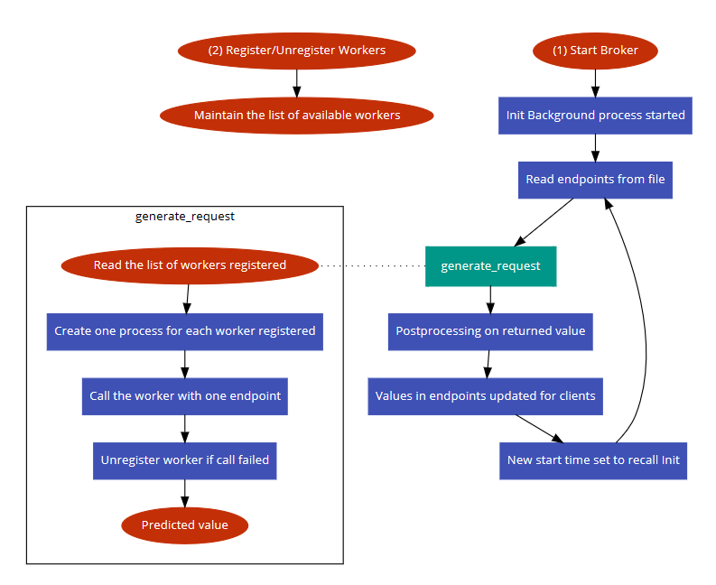
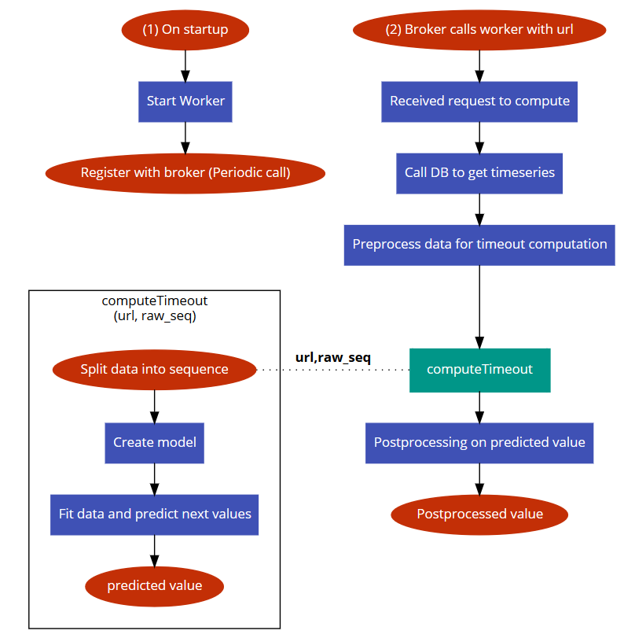

##JustInTimeout MultiDocker Broker

###Steps to setup system (using Docker):
1. Ensure your system has Docker installed in it.
2. cd into ./broker
3. Run `docker build -t broker .`
4. Run `docker run broker`
5. Wait for  __* Running on http://0.0.0.0:5000/ (Press CTRL+C to quit)__ message
6. cd into ./worker
7. (Optional) Reconfigure InfluxDB:
`Go to line 122 in timeoutcomputation.py and configure the Influx database host, username, password, port, etc.`
8. If you do not have an Influx database, set `dummy = True` on line 36 in timeoutcomputation.py to make computations using some dummy data configured.
9. Run `docker build -t worker .`
10. Run `docker run -e BROKER_IP=<BROKER_IP> -e INFLUX_IP=<INFLUX_IP> worker` (If you have followed step 7 to reconfigure, change INFLUX_IP accordingly)
11. Wait for  __* Running on http://0.0.0.0:7000/ (Press CTRL+C to quit)__ message
12. Now you can access the available endpoints at "http://\<BROKER_IP>:\<PORT>/getendpoints" (The default port is 5000)
13. Now you can access the computed timeouts at "http://\<BROKER_IP>:\<PORT>/gettimeout?url=\<ENDPOINT>"

### Non Docker setup:
To install required packages, find a file requirements.txt in broker and worker and run `pip install` on each of them.
1. Install Python3, Flask and pip using tutorials online.
2. cd into ./broker
3. Run `EXPORT FLASK_APP=broker`
4. Run `flask run`
5. Wait for  __* Running on http://0.0.0.0:5000/ (Press CTRL+C to quit)__ message
6. cd into ./worker
7. (Optional) Reconfigure InfluxDB: 
`Go to line 122 in timeoutcomputation.py and configure the Influx database host, username, password, port, etc.`
8. __If__ you do not have an Influx database, set `dummy = True` on line 36 in timeoutcomputation.py to make computations using some dummy data configured.
9. Run `EXPORT FLASK_APP=timeoutcomputation`
10. Run `EXPORT BROKER_IP=<BROKER_IP>`
11. Run `EXPORT INFLUX_IP=<INFLUX_IP>` (If you have followed step 7 to reconfigure, change INFLUX_IP accordingly)
12. Run `flask run`
13. Wait for  __* Running on http://0.0.0.0:7000/ (Press CTRL+C to quit)__ message
14. Now you can access the available endpoints at "http://\<BROKER_IP>:\<PORT>/getendpoints" (The default port is 5000)
15. Now you can access the computed timeouts at "http://\<BROKER_IP>:\<PORT>/gettimeout?url=\<ENDPOINT>"

Repeat steps 5-13 to setup more workers.

### Broker:

  

Important methods to note:
* gettimeoutvalue
* register
* unregister
* call_compute
* generate_request
* init
* getKeys

Working of these methods can be found as method descriptions in the python code

### Worker:
\
  

Important methods to note:
* compute
* computeTimeout
* register

Working of these methods can be found as method descriptions in the python code
