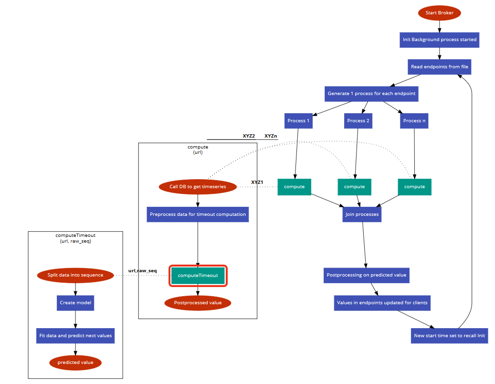

##JustInTimeout MultiProcess Broker

###Steps to setup system (using Docker):
1. Ensure your system has Docker installed in it.
2. (Optional) Reconfigure InfluxDB:
`Go to line 86 in broker.py and configure the Influx database host, username, password, port, etc.`
3. If you do not have an Influx database, set `dummy = True` on line 71 in broker.py to make computations using some dummy data configured.
4. Run `docker built -t broker .`
5. Run `docker run -e INFLUX_IP=<INFLUX_IP> broker` (If you have followed step 2 to reconfigure, change INFLUX_IP accordingly)
6. Wait for  __* Running on http://0.0.0.0:5000/ (Press CTRL+C to quit)__ message
7. Now you can access the available endpoints at "http://\<SERVER_IP>:\<PORT>/getendpoints" (The default port is 5000)
8. Now you can access the computed timeouts at "http://\<SERVER_IP>:\<PORT>/gettimeout?url=\<ENDPOINT>"

### Non Docker setup:
1. Install Python3, Flask and pip using tutorials online. (To install required packages, find a file requirements.txt and run `pip install` on each of them)
2. (Optional) Reconfigure InfluxDB:
`Go to line 86 in broker.py and configure the Influx database host, username, password, port, etc.`
3. If you do not have an Influx database, set `dummy = True` on line 71 in broker.py to make computations using some dummy data configured.
4. Run `EXPORT FLASK_APP=broker`
5. Run `EXPORT INFLUX_IP=<INFLUX_IP>` (If you have followed step 2 to reconfigure, change INFLUX_IP accordingly)
6. Run `flask run`
7. Wait for  __* Running on http://0.0.0.0:5000/ (Press CTRL+C to quit)__ message
8. Now you can access the available endpoints at "http://\<SERVER_IP>:\<PORT>/getendpoints" (The default port is 5000)
9. Now you can access the computed timeouts at "http://\<SERVER_IP>:\<PORT>/gettimeout?url=\<ENDPOINT>"

###Flow Diagram:
  

Important methods to note: (broker.py)
* compute
* gettimeoutvalue
* getKeys
* init

Important methods to note: (timeoutcomputation.py)
* computeTimeout

Working of these methods can be found as method descriptions in the python code.
